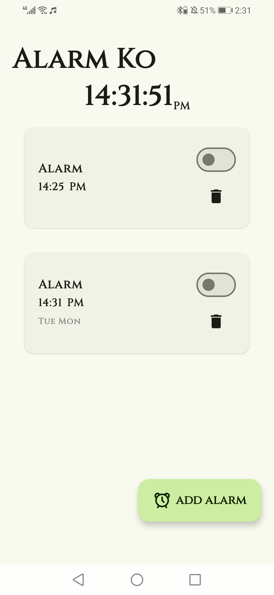
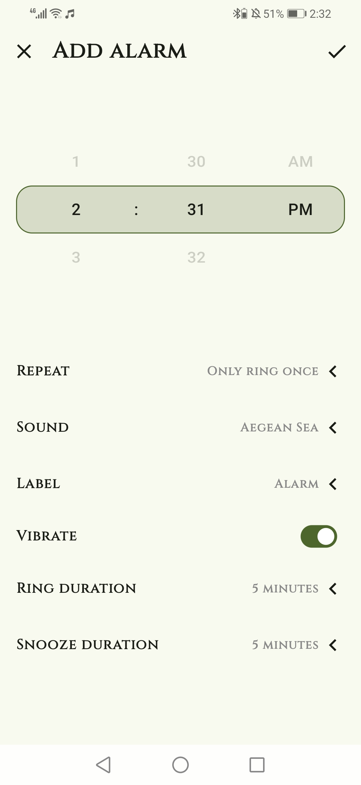
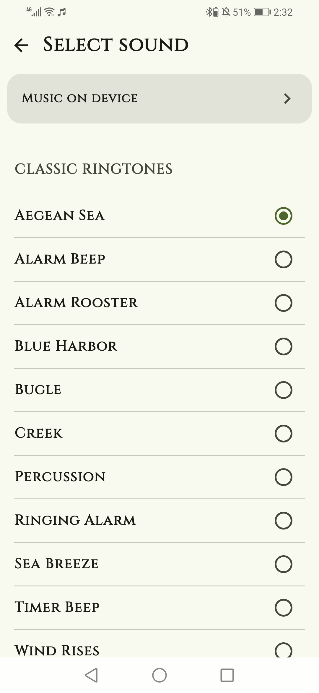
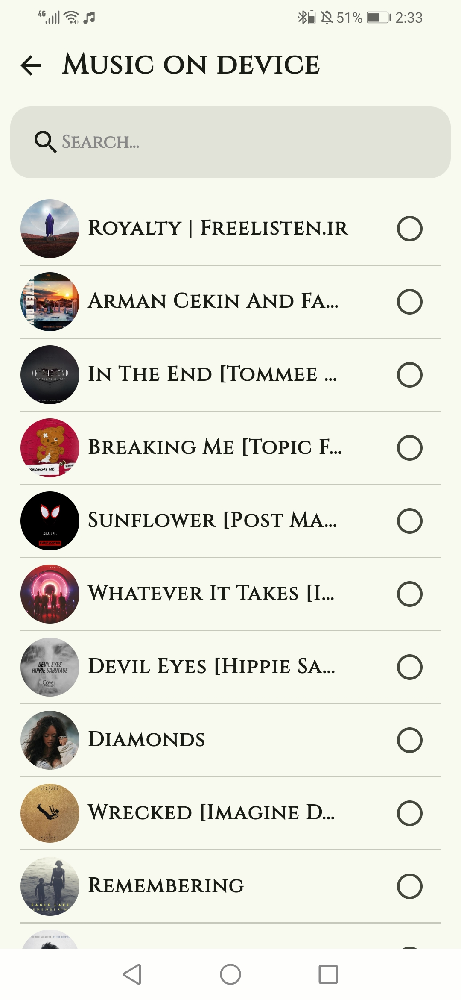

# Alarm Ko 

This is a straightforward alarm clock application designed to help you wake up on time. It includes basic features such as setting alarms, enabling vibrations, and selecting your preferred song to wake up to.

## ScreenShots 

  
  
  
  

## Libreries

* AlarmManager
* WokrkManager
* Room
* Dagger-Hilt
* coil
* lottieAnimation
  
 ## Contributing

  Feel free to fork this repository and submit pull requests. For major changes, please open an issue first to discuss what you would like to change.

  ## License

  This project is licensed under the MIT License.

